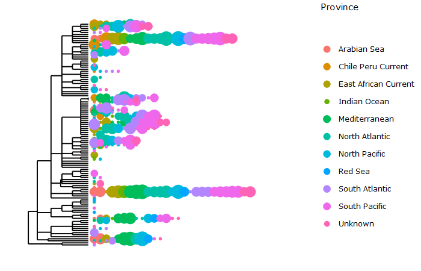

# Interactive Tree

## Summary

This R markdown document will create an interactive visualization of a phylogenetic tree.

Inputs are:
- OTU Table
- Map File
- Taxa Table
- Tree File

Or alternatively a phyloseq object.

Output is:
-  A phylogenetic tree in html format which allows some minimal interactions.

This R markdown file will lead you through the steps needed to import the data into phyloseq, create the needed functions, and draw the interactive tree. Once the tree is made, you will be able to see taxa names by mousing over, you can zoom in to sections, or isolate samples.

The tree file was created from the taxa file. If you want to see how that was done, look at the makeTree.R script.

## Author

Niel Infante
(ORCID: 0000-0002-1669-8795)

**Github Repository:** <https://github.com/speeding-up-science-workshops/metabarcode-SUS-Tree>

**Open Notebook (RStudio):** 
